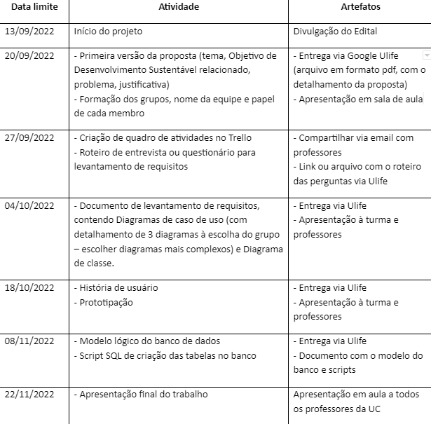
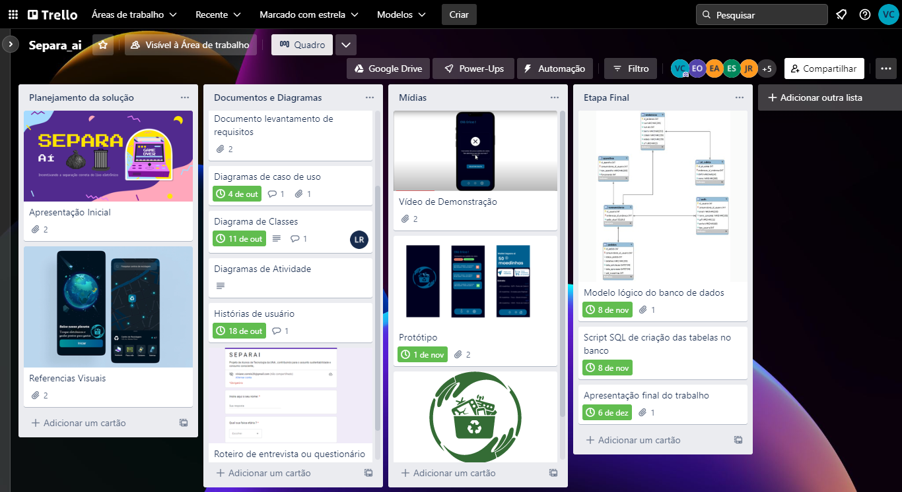

# Modelagem de Software  - 2022.2

Centro Universitário UNA - Professora: Erica Olivera

## Equipe:

- 1 analista de requisitos - Mateus Agler
- 1 analista de banco de dados - Erick
- 2 designers - Richard e João Pedro
- 2 desenvolvedores -Lucas e Matheus Vaz
- 1 gerente de projetos - Viviane
<table>
<tr>
<td align="center">

 
<b> Erick Sant'ana Araujo </b>
</td>
<td align="center">

 
<b> Mateus Agler Clark Silva </b>
</td>
<td align="center">

 
<b> Matheus de Andrade Vaz </b>
</td>
<td align="center">

 
<b> João Pedro Ferreira Rocha </b>
</td>
</tr>
<tr>
<td align="center">

 
<b> Lucas Fernando dos Reis </b>
</td>
<td align="center">

 
<b> Richard Garcia de Souza </b>
</td>

<td align="center">

 
<b> Viviane Corrêa Nunes </b>
</td>
</tr>
</table>

## Cronograma:

## Artefatos:
- Primeira Versão da Proposta 
- Quadro de atividades no Trello 
- Roteiro para levantamento de requisitos  
- Documento Levantamento de Requisitos  
- Histórias de usuário  
- Protótipo
- Modelo Lógico Banco de dados 
- Script SQL criação das tabelas no banco 
- Apresentação Final do Trabalho 

## Visão Geral do Trello
Durante a execução utilizamos uma adaptação da metodologia Kanban, utilizando as  seguintes colunas: 
- A fazer 
- Fazendo
- Feito 
- Entregue
 

Após a conclusão de todos os itens, agrupamos os itens em uma ordem lógica, observe no quadro abaixo:  
 
[Visualizar todos os artefatos no quadro do trello](https://trello.com/b/P8pawnV3/separaai)  
[Ver vídeo de demontração](https://drive.google.com/file/d/1e4oyD-rKnmN5PUfXc7lGyDEPLs2xf2oG/view?usp=sharing)  
[Visualizar Apresentação Final](https://docs.google.com/presentation/d/1928o0AbjFowq8ipgAo0DpVZAphINj59s6WhcDXYjAsE/edit?usp=sharing)